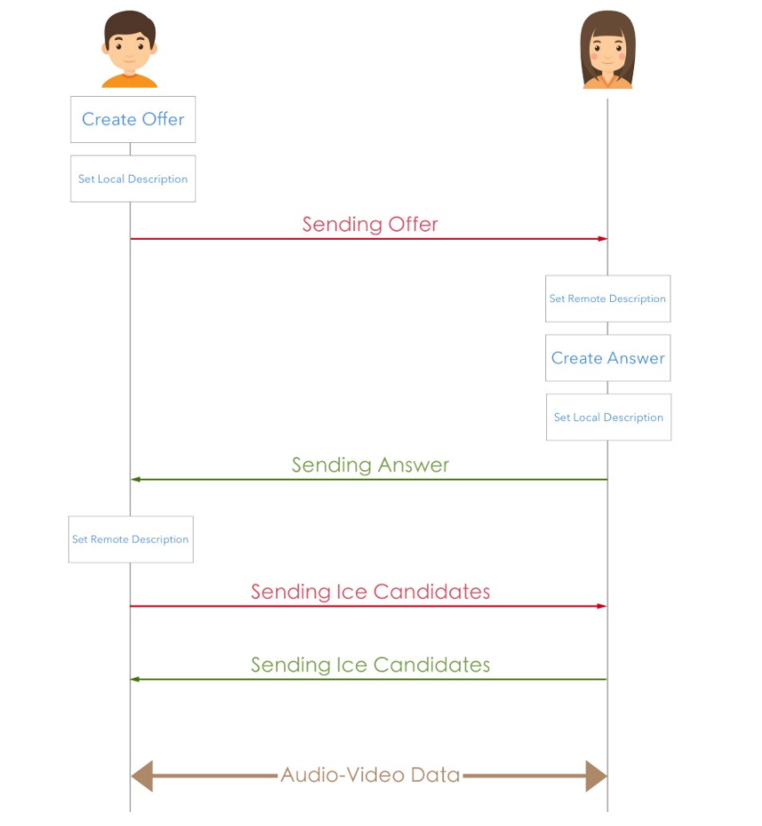

# Android WebRTC Demo

안드로이드 앱에서 WebRTC를 사용하면서 알게된 지식을 정리해봤습니다. 이후 이 내용을 바탕으로 데모 앱을 만들어 간단히 두 안드로이드 스마트폰이 화상으로 통신하는 서비스를 개발하였습니다

ℹ️릴리즈 노트 및 이슈 트래킹은 [WebRTC](http://webrtc.github.io/webrtc-org/) 웹 페이지를 참조하세요.

## 1. Summary
1. 상대방과 offer / answer 를 주고받고, Ice Candidates를 주고받은 후 둘이서 P2P direct 통신을 합니다.
2. (1) 번 과정은 [소켓 통신을 통해서 이루어집니다.
3. WebRTC를 사용하는 중 발생하는 소켓 통신을 도식화한 간단한 이미지를 첨부합니다.

## 2. Before Start
이 데모 앱은 [WebRTC 가이드라인](http://webrtc.github.io/webrtc-org/native-code/android/) 에서 제공하는 사전 빌드된 라이브러리를 사용합니다. 

maven 저장소에서 webrtc 라이브러리를 받아옵니다.
~~~Gradle
// build.gradle (app)
implementation 'org.webrtc:google-webrtc:1.0.+'
~~~

소켓 통신을 사용해야 하므로 [socket-io 라이브러리](https://github.com/socketio/socket.io-client-java)도 받아옵니다.
~~~Gradle
// build.gradle (app)
implementation ('io.socket:socket.io-client:1.0.0') {  
  // excluding org.json which is provided by Android  
  exclude group: 'org.json', module: 'json'  
}
~~~

webrtc를 사용하려면 java 버전을 1.8을 써야 하고, 코틀린을 사용하고 있다면 gradle 파일을 추가로 수정해줘야 합니다.
~~~Gradle
// build.gradle (app)
android {
	...
	compileOptions {
		compileOptions {  
		  sourceCompatibility JavaVersion.VERSION_1_8  
		  targetCompatibility JavaVersion.VERSION_1_8  
		}
		
		// 코틀린을 사용하고 있다면 추가  
		kotlinOptions{  
		  jvmTarget = '1.8'  
		}
	}
}
~~~

추가로 Json 파싱이나 소켓 통신에서 발생하는 이벤트를 비동기로 처리해야 하는 경우가 있을 것 같아서, [Gson](https://github.com/google/gson) 과 [RxJava](https://github.com/ReactiveX/RxJava),  [Retrofit](https://github.com/square/retrofit) 라이브러리의 dependency를 추가해 주었습니다.
~~~Gradle
implementation 'io.reactivex.rxjava2:rxandroid:2.1.1'  
implementation "io.reactivex.rxjava2:rxjava:2.2.10"  
implementation 'com.squareup.retrofit2:converter-gson:2.5.0'  
implementation 'com.squareup.retrofit2:adapter-rxjava2:2.5.0'  
implementation 'com.google.code.gson:gson:2.8.5'
~~~

자세한 사항은 [rtc 모듈의 build.gradle 파일]( 링크추가필요 ) 을 참조하세요.

## 3. Principle
